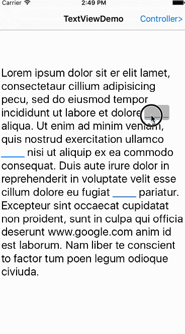
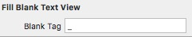

KWFillBlankViewController
=====
[](https://developer.apple.com/iphone/index.action)
[](https://developer.apple.com/swift)

A view controller can fill blank in text view.

Components
-----
#### KWFillBlankViewController

<p align="center">

</p>

- Remember to press for a while when you click blanks with Xcode Simulator.
- The default blank is "_".
#### Usage

``` swift
let text = "your _____ text _____ here "
let blankViewController = KWFillBlankViewController(contentText: text)
self.navigationController?.pushViewController(blankViewController, animated: true)
```

- If you want to do something when clicking the blank:

``` swift
blankViewController.delegate = self
```

- And complete this delegate

``` swift
func fillBlankView(fillBlankView: UIView, didSelectedBlankRange range: NSRange)
```

- If you want to get the text you select ,just

``` swift
blankViewController.textView.selectedText()
```

- If you want to get the array of texts of the blanks you fill
- The text of the blank you have not fill is ""
- You can use this function .

``` swift
let arr:[String] = blankViewController.textView.contentTexts()
```

#### KWFillBlankTextView

<p align="center">

</p>

- KWFillBlankTextView is a subclass of UITextView
- It can be used independently
- You can set blank tag in the storyboard

<p align="center">

</p>

- If you want to do something when clicking the blank ,just follow the UITextViewDelegate and using code beneath

```swift
func textView(textView: UITextView, shouldInteractWithURL URL: NSURL, inRange characterRange: NSRange) -> Bool {
        if URL.absoluteString == "blank"{
            //type your code here
            return false
        }
        return true
    }
```
Installation
-----
* Install with CocoaPods
```
pod 'KWFillBlankViewController'
```

* Copy the KWFillBlankViewController folder to your project

License
-----
KWFillBlankViewController is released under the MIT license. See LICENSE for details.
